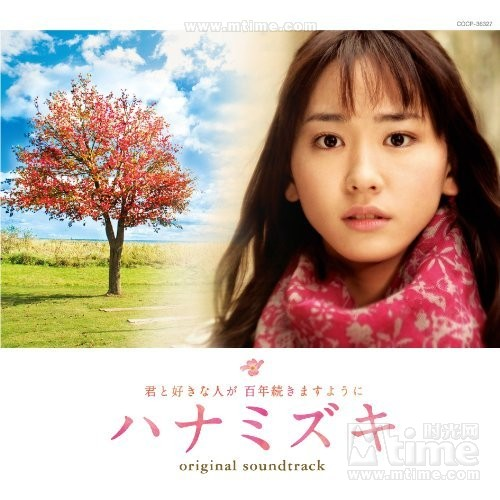
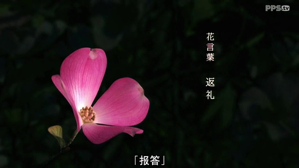
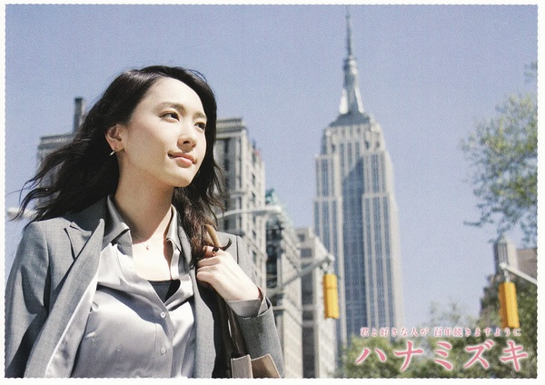
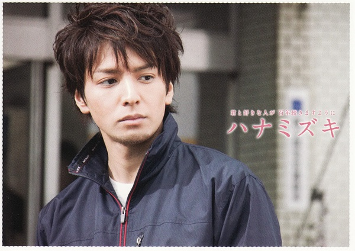
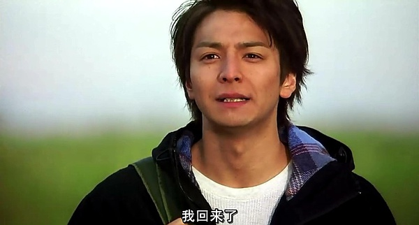

<!-- more -->

## 花水木
花水木的花语是感谢、回礼。

## 【花水木】
貌似好的电影总是需要有和它相配的音乐

[网易云音乐-花水木](http://music.163.com/#/outchain/2/33471935/)

电影的画面配上舒服的音乐，简直棒极了。刚开始看的时候就是被音乐吸引的。

## 她和他
新垣结衣，当初的女神，出演过很多部日系纯爱片，真的好漂亮有木有哇。
生田斗真，第一眼看到这个男主，让我想到了我的一个初中的死党，真的好像。当然，比我死党要帅。

## 十年前的相遇，十年后的重逢

1996年，北海道道东。因一次不容错过的考试，美丽的女孩平泽纱枝邂逅
了其他高中的同级生木内康平。康平的父亲是个渔夫，他一直帮父亲打渔，
虽然自己无意进学，他却鼓励的纱枝去追逐梦想。在他的鼓励下，一度放弃
的纱织最终考入了理想的大学。她来到东京，康平则留在北海道，两人展开
相隔两地的远距离恋爱，十年三国四地。

当然，最终在仁慈的导演手中，两人最终走在了一起。电影是美好的，转了一个圈，又回到了原点。

在电影的结尾，仰头望着那棵伴随纱枝成长的花水木，镜头顺着纱枝的视线，游离了多时康平也终于回到了视线之中。

故事淡淡的开始，淡淡的结束，留下的只是那棵老树，那场邂逅。

貌似大多数感情都是这样，爱情或是友情。也许是从某次的不期而遇，情窦初开，开始了懵懵懂懂的爱情，然后去追寻自己的梦想，一些失去一些懂得，渐渐的明白自己需要什么，兜兜转转，有的人回到了最初的起点，有的人可能永远都不会在回来了。

## 【后来】
电影和奶茶的【后来】是两种不一样的结局。好好的爱自己，时间会给你答案。

