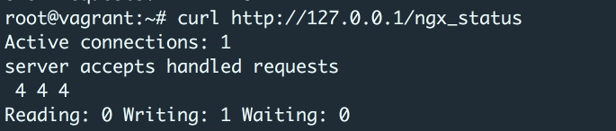
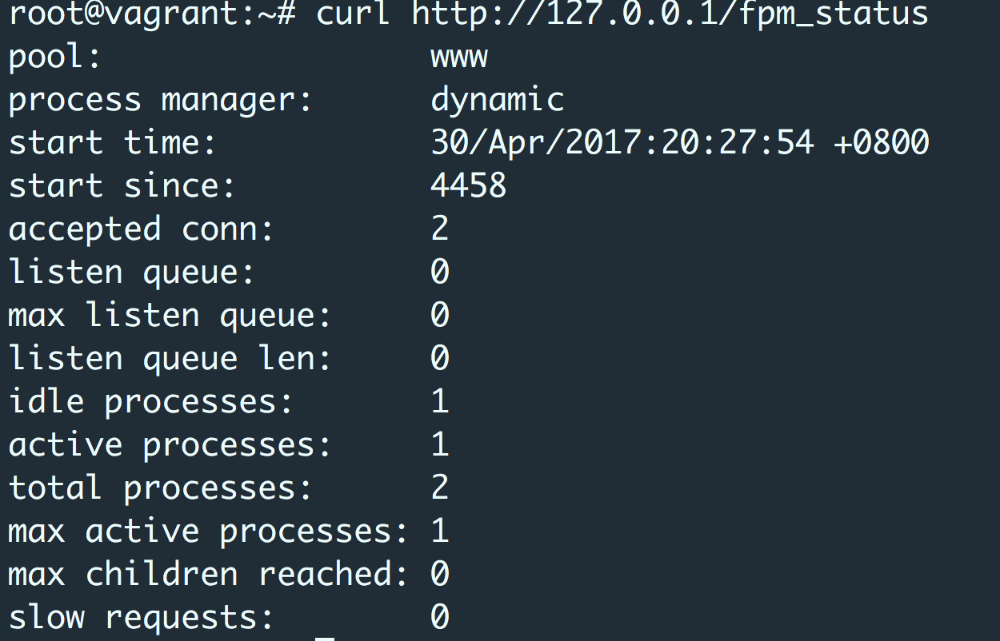

> 本文基于ubuntu16.04 php7.0

最近服务器的 php-fpm 进程偶尔会异常飙升，于是想在 zabbix 上配置监控服务器的 nginx 和 php-fpm 的状态。前提是需要开启 nginx 和 php-fpm 的 status 功能。

# 启用 nginx status 配置

- 配置 server ，一般我们在默认的主机下配置:

```
server {
        #listen 80;
        listen 80 default_server;
        root /var/www/html;
        index index.php index.html index.htm;

        server_name 127.0.0.1;

        location ~ \.php$ {
                include snippets/fastcgi-php.conf;
                fastcgi_pass unix:/run/php/php7.0-fpm.sock;
        }
        location /ngx_status {
                allow 127.0.0.1;
                deny all;
                stub_status on;
                access_log off;
        }
}
```
<!-- more -->

- 重启 nginx，测试访问

sudo /etc/init.d/nginx restart 

> curl http://127.0.0.1/ngx_status



- nginx status 参数说明

> active connections – 活跃的连接数量
> server accepts handled requests — 总共处理了4个连接 , 成功创建4次握手, 总共处理了4个请求
> reading — 读取客户端的连接数.
> writing — 响应数据到客户端的数量
>waiting — 开启 keep-alive 的情况下,这个值等于 active – (reading+writing), 意思就是 Nginx 已经处理完正在等候下一次请求指令的驻留连接.


---

# 启用 php-fpm status 配置

- 修改 php-fpm 配置，将 status 打开

vim /etc/php/7.0/fpm/pool.d/www.conf

> pm.status_path = /fpm_status

- 配置 server 

```
server {
        #listen 80;
        listen 80 default_server;
        root /var/www/html;
        index index.php index.html index.htm;

        server_name 127.0.0.1;

        location ~ \.php$ {
                include snippets/fastcgi-php.conf;
                fastcgi_pass unix:/run/php/php7.0-fpm.sock;
        }
        location ~ /fpm_status$ {
                allow 127.0.0.1;
                deny all;
                fastcgi_param SCRIPT_FILENAME $fastcgi_script_name;
                include fastcgi_params;
                fastcgi_pass unix:/run/php/php7.0-fpm.sock;
        }
}
```

- 重启 php-fpm 和 nginx，测试访问

> curl http://127.0.0.1/fpm_status



- php-fpm 参数说明

> pool #fpm池名称,大多数为www
> process manager #进程管理方式dynamic或者static
> start time #启动日志,如果reload了fpm，时间会更新
> start since #运行时间
> accepted conn #当前池接受的请求数
> listen queue #请求等待队列,如果这个值不为0,那么需要增加FPM的进程数量
> max listen queue #请求等待队列最高的数量
> listen queue len #socket等待队列长度
> idle processes #空闲进程数量
> active processes #活跃进程数量 
> total processes #总进程数量 
> max active processes #最大的活跃进程数量（FPM启动开始计算）
> max children reached #程最大数量限制的次数，如果这个数量不为0，那说明你的最大进程数量过小,可以适当调整。


Happy Coding.


